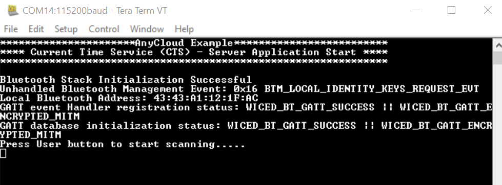
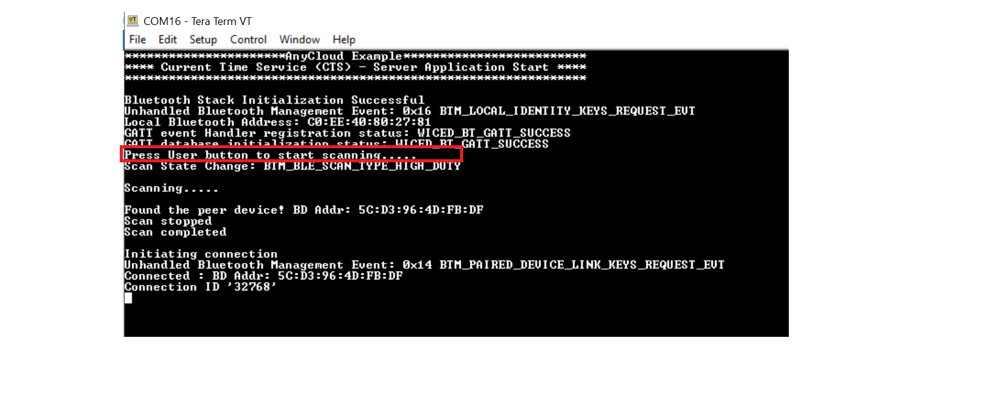
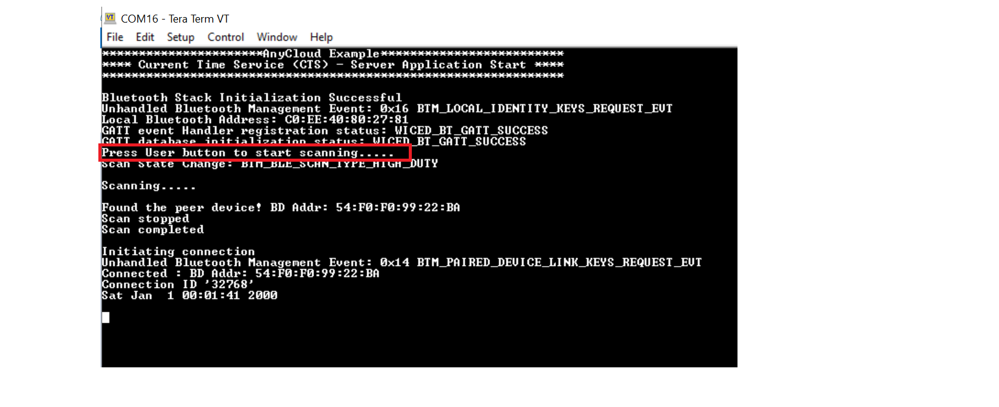
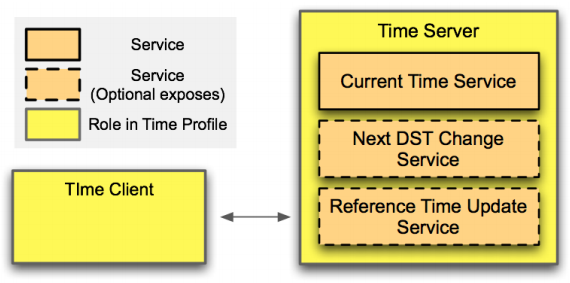

# Bluetooth&reg; LE CTS server

This code example demonstrates the implementation of a simple AIROC&trade; Bluetooth&reg; LE GAP central - GATT server with Current time service ([CTS](https://www.bluetooth.com/xml-viewer/?src=https://www.bluetooth.com/wp-content/uploads/Sitecore-Media-Library/Gatt/Xml/Services/org.bluetooth.service.current_time.xml)) using the Cypress Combo (Wi-Fi+Bluetooth&reg;) SoCs and ModusToolbox™ Software Environment.

In this code example, the kit scans for "CTS client", and after connection with a CTS-based client, sends notifications with Current time characteristic values derived from the local date and time. The time and date sent as notification are printed on the serial terminal.

This code example along with Bluetooth&reg; LE CTS Client CE [AnyCloud BLE CTS Client](https://github.com/Infineon/mtb-example-anycloud-ble-cts-client) are low power enabled for AIROC&trade; Bluetooth&reg; LE and can be used to measure current consumption by PSoC&trade; 6 (not optimized for power) and CYW43XXX when using AIROC&trade; Bluetooth&reg; LE feature. Refer to [AN227910: Low-power system design with CYW43012 and PSoC&trade; 6 MCU](https://www.cypress.com/documentation/application-notes/an227910-low-power-system-design-cyw43012-and-psoc-6-mcu) to learn about Bluetooth&reg; power optimization techniques and power measurement using this CE.

[View this README on GitHub.](https://github.com/Infineon/mtb-example-anycloud-ble-cts-server)

[Provide feedback on this code example.](https://cypress.co1.qualtrics.com/jfe/form/SV_1NTns53sK2yiljn?Q_EED=eyJVbmlxdWUgRG9jIElkIjoiQ0UyMzAzMDIiLCJTcGVjIE51bWJlciI6IjAwMi0zMDMwMiIsIkRvYyBUaXRsZSI6IkJsdWV0b290aCZyZWc7IExFIENUUyBzZXJ2ZXIiLCJyaWQiOiJkcmFqIiwiRG9jIHZlcnNpb24iOiIyLjAuMCIsIkRvYyBMYW5ndWFnZSI6IkVuZ2xpc2giLCJEb2MgRGl2aXNpb24iOiJNQ0QiLCJEb2MgQlUiOiJJQ1ciLCJEb2MgRmFtaWx5IjoiUFNPQyJ9)

## Requirements

- [ModusToolbox&trade; software](https://www.cypress.com/products/modustoolbox-software-environment) v2.3 with ModusToolbox&trade; software tools patch 2.3.1
- Board support package (BSP) minimum required version: 2.0.0
- Programming language: C
- Associated parts: All [PSoC&trade; 6 MCU](http://www.cypress.com/PSoC6) with [AIROC™ CYW43012 Wi-Fi & Bluetooth® combo chip](https://www.cypress.com/products/cyw43012), [AIROC™ CYW4343W Wi-Fi & Bluetooth® combo chip](https://www.cypress.com/products/cyw4343w), [AIROC™ CYW43438 Wi-Fi & Bluetooth® combo chip](https://www.cypress.com/products/cyw43438), [AIROC™ CYW4373 Wi-Fi & Bluetooth® combo chip](https://www.cypress.com/products/cyw4373)

## Supported toolchains (make variable 'TOOLCHAIN')

- GNU Arm® embedded compiler v9.3.1 (`GCC_ARM`) - Default value of `TOOLCHAIN`
- Arm&reg; compiler v6.13 (`ARM`)
- IAR C/C++ compiler v8.42.2 (`IAR`)

## Supported kits (make variable 'TARGET')

- [PSoC&trade; 6 Wi-Fi Bluetooth® prototyping kit](https://www.cypress.com/CY8CPROTO-062-4343W) (`CY8CPROTO-062-4343W`) – Default value of `TARGET`
- [PSoC&trade; 6 Wi-Fi Bluetooth&reg; pioneer kit](https://www.cypress.com/CY8CKIT-062-WiFi-BT) (`CY8CKIT-062-WIFI-BT`)
- [PSoC&trade; 62S2 Wi-Fi Bluetooth&reg; pioneer kit](https://www.cypress.com/CY8CKIT-062S2-43012) (`CY8CKIT-062S2-43012`)
- [PSoC&trade; 62S1 Wi-Fi Bluetooth&reg; pioneer kit](https://www.cypress.com/CYW9P62S1-43438EVB-01) (`CYW9P62S1-43438EVB-01`)
- [PSoC&trade; 62S1 Wi-Fi Bluetooth&reg; pioneer kit](https://www.cypress.com/CYW9P62S1-43012EVB-01) (`CYW9P62S1-43012EVB-01`)
- [PSoC&trade; 62S3 Wi-Fi Bluetooth&reg; prototyping kit](https://www.cypress.com/CY8CPROTO-062S3-4343W) (`CY8CPROTO-062S3-4343W`)
- [PSoC&trade; 64 "Secure Boot" Wi-Fi Bluetooth&reg; pioneer kit](https://www.cypress.com/CY8CKIT-064B0S2-4343W) (`CY8CKIT-064B0S2-4343W`)
- [PSoC 62S2 Evaluation kit](https://www.cypress.com/documentation/development-kitsboards/psoc-62s2-evaluation-kit-cy8ceval-062s2) (`CY8CEVAL-062S2-LAI-4373M2`)

## Hardware setup

This example uses the board's default configuration. See the kit user guide to ensure that the board is configured correctly.

**Note:** The PSoC&trade; 6 Bluetooth&reg; LE pioneer kit (CY8CKIT-062-BLE) and the PSoC&trade; 6 Wi-Fi Bluetooth&reg; pioneer kit (CY8CKIT-062-WIFI-BT) ship with KitProg2 installed. The ModusToolbox&trade; software requires KitProg3. Before using this code example, make sure that the board is upgraded to KitProg3. The tool and instructions are available in the [Firmware Loader](https://github.com/Infineon/Firmware-loader) GitHub repository. If you do not upgrade, you will see an error like "unable to find CMSIS-DAP device" or "KitProg firmware is out of date".

## Software setup
Install a terminal emulator if you don't have one. Instructions in this document use [Tera Term](https://ttssh2.osdn.jp/index.html.en).

This example requires no additional software or tools.

## Using the code example

Create the project and open it using one of the following:

<details><summary><b>In Eclipse IDE for ModusToolbox&trade; software</b></summary>

1. Click the **New Application** link in the **Quick Panel** (or, use **File** > **New** > **ModusToolbox Application**). This launches the [Project Creator](https://www.cypress.com/ModusToolboxProjectCreator) tool.

2. Pick a kit supported by the code example from the list shown in the **Project Creator - Choose Board Support Package (BSP)** dialog.

   When you select a supported kit, the example is reconfigured automatically to work with the kit. To work with a different supported kit later, use the [Library Manager](https://www.cypress.com/ModusToolboxLibraryManager) to choose the BSP for the supported kit. You can use the Library Manager to select or update the BSP and firmware libraries used in this application. To access the Library Manager, click the link from the **Quick Panel**.

   You can also just start the application creation process again and select a different kit.

   If you want to use the application for a kit not listed here, you may need to update the source files. If the kit does not have the required resources, the application may not work.

3. In the **Project Creator - Select Application** dialog, choose the example by enabling the checkbox.

4. (Optional) Change the suggested **New Application Name**.

5. The **Application(s) Root Path** defaults to the Eclipse workspace which is usually the desired location for the application. If you want to store the application in a different location, you can change the *Application(s) Root Path* value. Applications that share libraries should be in the same root path.

6. Click **Create** to complete the application creation process.

For more details, see the [Eclipse IDE for ModusToolbox&trade; software user guide](https://www.cypress.com/MTBEclipseIDEUserGuide) (locally available at *{ModusToolbox&trade; software install directory}/ide_{version}/docs/mt_ide_user_guide.pdf*).

</details>

<details><summary><b>In command-line interface (CLI)</b></summary>

ModusToolbox&trade; software provides the Project Creator as both a GUI tool and the command line tool, "project-creator-cli". The CLI tool can be used to create applications from a CLI terminal or from within batch files or shell scripts. This tool is available in the *{ModusToolbox&trade; software install directory}/tools_{version}/project-creator/* directory.

Use a CLI terminal to invoke the "project-creator-cli" tool. On Windows, use the command line "modus-shell" program provided in the ModusToolbox&trade; software installation instead of a standard Windows command-line application. This shell provides access to all ModusToolbox&trade; software tools. You can access it by typing `modus-shell` in the search box in the Windows menu. In Linux and macOS, you can use any terminal application.

This tool has the following arguments:

Argument | Description | Required/optional
---------|-------------|-----------
`--board-id` | Defined in the `<id>` field of the [BSP](https://github.com/Infineon?q=bsp-manifest&type=&language=&sort=) manifest | Required
`--app-id`   | Defined in the `<id>` field of the [CE](https://github.com/Infineon?q=ce-manifest&type=&language=&sort=) manifest | Required
`--target-dir`| Specify the directory in which the application is to be created if you prefer not to use the default current working directory | Optional
`--user-app-name`| Specify the name of the application if you prefer to have a name other than the example's default name | Optional

<br>

The following example will clone the "[Bluetooth&reg; LE CTS server](https://github.com/Infineon/mtb-example-anycloud-ble-cts-server)" application with the desired name "mtb-example-anycloud-ble-cts-server" configured for the *CY8CPROTO-062-4343W* BSP into the specified working directory, *C:/mtb_projects*:

   ```
   project-creator-cli --board-id CY8CPROTO-062-4343W --app-id mtb-example-anycloud-ble-cts-server --user-app-name mtb-example-anycloud-ble-cts-server --target-dir "C:/mtb_projects"
   ```

**Note:** The project-creator-cli tool uses the `git clone` and `make getlibs` commands to fetch the repository and import the required libraries. For details, see the "Project creator tools" section of the [ModusToolbox&trade; software user guide](https://www.cypress.com/ModusToolboxUserGuide) (locally available at *{ModusToolbox&trade; software install directory}/docs_{version}/mtb_user_guide.pdf*).

</details>

<details><summary><b>In third-party IDEs</b></summary>

   1. Follow the instructions from the **In command-line interface (CLI)** section to create the application, and then import the libraries using the `make getlibs` command.

   2. Export the application to a supported IDE using the `make <ide>` command.

   3. Follow the instructions displayed in the terminal to create or import the application as an IDE project.

For a list of supported IDEs and more details, see the "Exporting to IDEs" section of the [ModusToolbox&trade; software user guide](https://www.cypress.com/ModusToolboxUserGuide) (locally available at *{ModusToolbox&trade; software install directory}/docs_{version}/mtb_user_guide.pdf*).

</details>

## Operation

If using a PSoC&trade; 64 "Secure" MCU kit (like CY8CKIT-064B0S2-4343W), the PSoC&trade; 64 device must be provisioned with keys and policies before being programmed. Follow the instructions in the ["Secure Boot" SDK user guide](https://www.cypress.com/documentation/software-and-drivers/psoc-64-secure-mcu-secure-boot-sdk-user-guide) to provision the device. If the kit is already provisioned, copy-paste the keys and policy folder to the application folder.

1. Connect the board to your PC using the provided USB cable through the KitProg3 USB connector.

2. Use your favorite serial terminal application and connect to the KitProg3 COM port. Configure the terminal application to access the serial port using the following settings.

   Baud rate : 115200 bps; Data: 8 bits; Parity : None; Stop : 1 bit; Flow control : None; New line for receive data : Line Feed(LF) or Auto setting

3. Program the board using one of the following:

   <details><summary><b>Using Eclipse IDE for ModusToolbox&trade; software</b></summary>

      1. Select the application project in the Project Explorer.

      2. In the **Quick Panel**, scroll down, and click **\<Application Name> Program (KitProg3_MiniProg4)**.
   </details>

   <details><summary><b>Using CLI</b></summary>

     From the terminal, execute the `make program` command to build and program the application using the default toolchain to the default target. The default toolchain and target are specified in the application's Makefile but you can override those values manually:
      ```
      make program TARGET=<BSP> TOOLCHAIN=<toolchain>
      ```

      Example:
      ```
      make program TARGET=CY8CPROTO-062-4343W TOOLCHAIN=GCC_ARM
      ```
   </details>

4. After programming, the application starts automatically. Observe the messages on the UART terminal, and wait for the device to initialize required components. Use the KitProg3 COM port to view the Bluetooth stack and application trace messages in the terminal window as shown in Figure 1.

   **Figure 1. Terminal output - Terminal output when the device is programmed with the CE**
   

5. Use another supported PSoC&trade; 6 kit and program it with the [Bluetooth&reg; LE CTS client](https://github.com/Infineon/mtb-example-anycloud-ble-cts-client) code example.

6. Once both the kits are powered, press the user button (SW2) on the client device to start the advertisement and then press button (SW2) on the server to start the scanning. The application trace messages in the terminal window as shown in Figure 2.

   **Figure 2. Terminal output - Scanning and connecting**
   

7. After establishing the connection between the client and server, press the button(SW2) on the client to enable the notification. Then the server device will start sending the notification with current time characteristic values derived from the device real-time clock. The date and time sent as notification will be printed on the serial terminal.

   **Figure 3. Terminal output - Sending notification**
   

## Debugging

You can debug the example to step through the code. In the IDE, use the **\<Application Name> Debug (KitProg3_MiniProg4)** configuration in the **Quick Panel**. For details, see the "Program and debug" section in the [Eclipse IDE for ModusToolbox&trade; software user guide](https://www.cypress.com/MTBEclipseIDEUserGuide).

**Note:** **(Only while debugging)** On the CM4 CPU, some code in `main()` may execute before the debugger halts at the beginning of `main()`. This means that some code executes twice – once before the debugger stops execution, and again after the debugger resets the program counter to the beginning of `main()`. See [KBA231071](https://community.cypress.com/docs/DOC-21143) to learn about this and for the workaround.

**Note:**
Debugging is of limited value when there is an active Bluetooth&reg; LE connection because as soon as the Bluetooth&reg; LE device stops responding, the connection will get dropped.

## Design and implementation

The [Bluetooth&reg; LE CTS server](https://github.com/cypresssemiconductorco/mtb-example-anycloud-ble-cts-server) code example configures the device as a Bluetooth&reg; LE GAP central - GATT server device. Use this application with the [Bluetooth&reg; CTS client](https://github.com/Infineon/mtb-example-anycloud-ble-cts-client), which is a GAP peripheral - GATT client device.

This code example showcases Current Time Service-based time profile. In this CE, the mandatory Current time characteristic with Read and notify properties are implemented. The Time profile defines two roles: Time server (GATT Server) and Time client (GATT Client).

**Figure 4. Time profile role and service relationships**


The entry point of the application is `int main()`, which initializes the Board Support Package (BSP) and Bluetooth&reg; stack. The application level initializations like RTC, GATT database initialization, are handled by the `ble_app_init()` function. This function starts scanning for the peripheral device by registering a callback using `wiced_bt_ble_scan()`.

This application will specifically scan for advertisement with the Peripheral device name `CTS Client` and establish a LE GATT connection. All the GATT events are handled in `ble_app_gatt_event_handler()`. During Read or notify GATT operations, the fields of the Current time characteristic are set to values derived from the local date and time and sent as GATT read response or as notification to the peripheral device. The same data is printed on the serial terminal.

The RTC provides time and date information – second, minute, hour, day of the week, date, month, and year using the RTC driver API. The time and date information are updated every second with automatic leap year compensation performed by the RTC hardware block. The RTC initialization is also done in `ble_app_init()`.

The application uses a UART resource from the Hardware Abstraction Layer (HAL) to print debug messages on a UART terminal emulator. The UART resource initialization and retargeting of the standard I/O to the UART port is done using the retarget-io library.

**Implementation of low power for AIROC&trade; Bluetooth&reg; LE**

**Power measurement**

This examples enables you to measure power in three different AIROC&trade; Bluetooth&reg; LE states: Standby state, Scanning state and Connected state. Below steps guide you on how to enter each state and how to measure power for different kits.

To enter different states:

1. Standby state: After programming the device, AIROC&trade; Bluetooth&reg; LE is initialized and stays in standby state. On the terminal, check for the message 'Bluetooth stack initialization successful' and now you can measure power for standby state.

2. Scanning state: Press user button(SW2) on your kit to start scanning. Note that, the kit with CTS client CE must be advertising when we start scanning. When it discovers the peer device, it sends a connection request. A high duty scan will be performed initially for 30 seconds. Then the device switches to low duty scanning without timeout. High duty scanning of 30 seconds is chosen for faster discovery. This configuration can be changed if required using the tool 'bt-configurator' that comes with Modustoolbox&trade; installation.

3. Connected state: Once scanner finds the advertiser, connection is established. The terminal displays the message 'Connected : BDA xx:xx:xx:xx:xx:xx'.

Current measuring points for kits:

### CY8CKIT-062S2-43012, CYW9P62S1-43438EVB-01, CYW9P62S1-43012EVB-01 and CY8CKIT-064B0S2-4343W

**For PSoC 6 MCU:**

      a. Remove J25 to eliminate leakage currents across potentiometer R1.

      b. Measure the current at J15 across VTARG and P6_VDD.

**For CYW43xxx:**

      Measure the current at VBAT across VBAT and VCC_VBAT at J8.

### CY8CEVAL-062S2-LAI-4373M2

**For PSoC 6 MCU:**

      a. Remove J21 to eliminate leakage currents across potentiometer R1.

      b. Measure the current at J15 across VTARG and P6_VDD.

**For CYW4373E:**

      Measure the current at VBAT across VBAT and VCC_VBAT at J11.

### CY8CPROTO-062-4343W

**For PSoC 6 MCU:**

      a. Remove R65 on the right of the board close to the USB connector of the PSoC 6 MCU device.

      b. Connect an ammeter between VTARG (J2.32) and P6_VDD (J2.24).

      c. Remove R24 at the back of the board, below J1.9, to eliminate the leakage current.

         R24 is the pull-up resistor attached to the WL_HOST_WAKE pin P0_4, which leaks approximately 330 uA because P0_4 is driven LOW when there is no network activity. In total, the PSoC 6 MCU deep sleep current is approximately 350 uA.

**For CYW4343W:**

   Measure the current at VBAT1 and VBAT2 supplies used for powering CYW4343W. VBAT1 and VABT2 are shorted to each other.

      a. Remove R87 on the back of the board towards the right and above J2.33.
      b. Connect an ammeter between the pads of R87 to measure the current.

### CY8CKIT-062-WIFI-BT

**For PSoC 6 MCU:**

      Measure the current  by connecting an ammeter to the PWR MON jumper J8.

**For CYW4343W:**

      Measure the current at WL_VBAT(used for powering CYW4343W) by removing L3 along the right edge of the board close to the CYW4343W module, and connecting an ammeter between the pads of L3.

### CY8CPROTO-062S3-4343W

**For PSoC 6 MCU:**

      Measure the current by removing R59 and connecting an ammeter across VTARG(J2.32) and P6_VDD(J2.31)

**For CYW4343W:**

      Measure the current by removing R55 and connecting an ammeter between the resistor pads (VCC_3V6 and VBAT_WL).

Table 1 captures the current numbers measured using this CE for two BSPs. The kits have different connectivity devices - CYW43012 and CYW43438. The measurement is not performed in a radio isolated environment. Current consumption by PSoC&trade; 6 device is also measured and it was identical across all Bluetooth&reg; states. The average current value is given below:
1. For PSoC&trade; 6 device in CY8CKIT-062S2-43012: 27 uA
2. For PSOC&trade; 6 device in CYW9P62S1-43438EVB-01: 620 uA
3. For PSOC6 device in CY8CEVAL-062S2-LAI-4373M2: 23 uA

**Table 1. Current numbers**

 |Bluetooth State|Setting |CY8CKIT-062S2-43012|CYW9P62S1-43438EVB-01|CY8CEVAL-062S2-LAI-4373M2|
 | :-------      | :------------      | :------------   | :------------ | :----------- |
 |Standby state      |Stack initialized      |3.65 mA  |4.21 mA   |10.71 mA  |
 |High Duty Scanning |Scan interval: 120 ms  |4.42 mA  |5.67 mA   |7.9 mA    |
 |Low Duty Scanning  |Scan interval: 2560 ms |86.23 uA |111.78 uA |535.485 uA|


### Resources and settings
This section explains the ModusToolbox&trade; resources and their configuration as used in this code example. Note that all the configuration explained in this section has already been done in the code example.

- **Device configurator:** ModusToolbox&trade; stores the configuration settings of the application in the *design.modus* file. This file is used by the Device Configurator, which generates the configuration firmware. This firmware is stored in the application’s *GeneratedSource* folder. By default, all applications in a workspace share the same *design.modus* file - i.e., they share the same pin configuration. Each BSP has a default *design.modus* file in the *mtb_shared\TARGET_\<bsp name\>\\<version\>\COMPONENT_BSP_DESIGN_MODUS* directory. It is not recommended to modify the configuration of a standard BSP directly. To modify the configuration for a single application or to create a custom BSP refer to the [ModusToolbox&reg; User Guide](https://www.cypress.com/file/504361/download). In this example we are using the default configuration.
For detailed information on how to use the Device Configurator, see the
[Device Configurator Guide](https://www.cypress.com/ModusToolboxDeviceConfig).

- **Bluetooth&reg; configurator:** The Bluetooth&reg; peripheral has an additional configurator called the “Bluetooth&reg; Configurator” that is used to generate the AIROC&trade; Bluetooth&reg; LE GATT database and various bluetooth settings for the application. These settings are stored in the file named *design.cybt*. Note that unlike the Device Configurator, the Bluetooth&reg; Configurator settings and files are local to each respective application.
For detailed information on how to use the Bluetooth&reg; Configurator, see the [Bluetooth&reg; Configurator Guide](https://www.cypress.com/ModusToolboxBLEConfig).

**Table 2. Application resources**

 Resource  |  Alias/object     |    Purpose
| :------- | :------------    | :------------ |
| UART (HAL)|cy_retarget_io_uart_obj| UART HAL object used by Retarget-IO for Debug UART port.|
| GPIO (HAL)    | CYBSP_USER_BTN         | Start advertisement or enable/disable notification.|


## Related resources

| Application notes                                            |                                                              |
| :----------------------------------------------------------- | :----------------------------------------------------------- |
| [AN228571](https://www.cypress.com/AN228571) – Getting started with PSoC&trade; 6 MCU on ModusToolbox&trade; | Describes PSoC&trade; 6 MCU devices and how to build your first application with ModusToolbox&trade; |
| [AN221774](https://www.cypress.com/AN221774) – Getting started with PSoC&trade; 6 MCU on PSoC&trade; Creator | Describes PSoC&trade; 6 MCU devices and how to build your first application with PSoC&trade; Creator |
| [AN210781](https://www.cypress.com/AN210781) – Getting started with PSoC&trade; 6 MCU with AIROC&trade; Bluetooth&reg; Low Energy (Bluetooth LE) connectivity on PSoC&trade; Creator | Describes PSoC&trade; 6 MCU with AIROC&trade; Bluetooth&reg; LE connectivity devices and how to build your first application with PSoC&trade; Creator |
| [AN215656](https://www.cypress.com/AN215656) – PSoC&trade; 6 MCU: dual-CPU system design | Describes the dual-CPU architecture in PSoC&trade; 6 MCU, and shows how to build a simple dual-CPU design |
| **Code examples**                                            |                                                              |
| [Using ModusToolbox&trade;](https://github.com/cypresssemiconductorco/Code-Examples-for-ModusToolbox-Software) | [Using PSoC&trade; Creator](https://www.cypress.com/documentation/code-examples/psoc-6-mcu-code-examples) |
| **Device documentation**                                     |                                                              |
| [PSoC&trade; 6 MCU datasheets](https://www.cypress.com/search/all?f[0]=meta_type%3Atechnical_documents&f[1]=resource_meta_type%3A575&f[2]=field_related_products%3A114026) | [PSoC&trade; 6 Technical reference manuals](https://www.cypress.com/search/all/PSoC%206%20Technical%20Reference%20Manual?f[0]=meta_type%3Atechnical_documents&f[1]=resource_meta_type%3A583) |
| **Development kits**                                         | Buy at www.cypress.com                                        |
| [CY8CKIT-062-BLE](https://www.cypress.com/CY8CKIT-062-BLE) PSoC&trade; 6 AIROC&trade; Bluetooth&reg; LE pioneer kit | [CY8CKIT-062-WiFi-BT](https://www.cypress.com/CY8CKIT-062-WiFi-BT) PSoC&trade; 6 AIROC&trade; Wi-Fi and Bluetooth® pioneer kit |
| [CY8CPROTO-063-BLE](https://www.cypress.com/CY8CPROTO-063-BLE) PSoC&trade; 6 AIROC&trade; Bluetooth&reg; LE prototyping kit | [CY8CPROTO-062-4343W](https://www.cypress.com/CY8CPROTO-062-4343W) PSoC&trade; 6 AIROC&trade; Wi-Fi and Bluetooth® prototyping kit |
| [CY8CKIT-062S2-43012](https://www.cypress.com/CY8CKIT-062S2-43012) PSoC&trade; 62S2 AIROC&trade; Wi-Fi and Bluetooth® pioneer kit | [CY8CPROTO-062S3-4343W](https://www.cypress.com/CY8CPROTO-062S3-4343W) PSoC&trade; 62S3 AIROC&trade; Wi-Fi and Bluetooth® prototyping kit |
| [CYW9P62S1-43438EVB-01](https://www.cypress.com/CYW9P62S1-43438EVB-01) PSoC&trade; 62S1 AIROC&trade; Wi-Fi and Bluetooth® pioneer kit | [CYW9P62S1-43012EVB-01](https://www.cypress.com/CYW9P62S1-43012EVB-01) PSoC&trade; 62S1 AIROC&trade; Wi-Fi and Bluetooth® pioneer kit |
| [CY8CKIT-064B0S2-4343W](http://www.cypress.com/CY8CKIT-064B0S2-4343W) PSoC&trade; 64 Secure Boot AIROC&trade; Wi-Fi and Bluetooth® pioneer kit |            |
| **Libraries**                                                |                                                              |
| PSoC&trade; 6 peripheral driver library (PDL) and docs  | [mtb-pdl-cat1](https://github.com/Infineon/mtb-pdl-cat1) on GitHub |
| Cypress Hardware abstraction layer (HAL) library and docs    | [mtb-hal-cat1](https://github.com/Infineon/mtb-hal-cat1) on GitHub |
| Retarget IO - A utility library to retarget the standard input/output (STDIO) messages to a UART port | [retarget-io](https://github.com/Infineon/retarget-io) on GitHub |
| freeRTOS library and docs                                    | [freeRTOS](https://github.com/Infineon/freertos) on GitHub |
|bluetooth-freeRTOS|Cypress WICED BT/Bluetooth LE Host Stack solution [bluetooth-freeRTOS](https://github.com/Infineon/bluetooth-freertos) on GitHub|
| **Middleware**                                               |                                                              |
| CAPSENSE&trade; library and docs                                    | [CAPSENSE&trade;](https://github.com/Infineon/capsense) on GitHub |
| Links to all PSoC&trade; 6 MCU middleware                           | [psoc6-middleware](https://github.com/Infineon/modustoolbox-software) on GitHub |
| **Tools**                                                    |                                                              |
| [Eclipse IDE for ModusToolbox&trade; software](https://www.cypress.com/modustoolbox) | ModusToolbox&trade software is a collection of easy-to-use software and tools enabling rapid development with Infineon MCUs, covering applications from embedded sense and control to wireless and cloud-connected systems using AIROC&trade; Wi-Fi and Bluetooth® connectivity devices. |

## Other resources

Cypress provides a wealth of data at www.cypress.com to help you select the right device, and quickly and effectively integrate it into your design.

For PSoC&trade; 6 MCU devices, see [How to design with PSoC&trade; 6 MCU - KBA223067](https://community.cypress.com/docs/DOC-14644) in the Cypress community.

## Document history

Document title: *CE230302 – Bluetooth&reg; LE CTS server*

| Version | Description of change |
| ------- | --------------------- |
| 1.0.0   | New code example      |
| 2.0.0   | Major update to support ModusToolbox software v2.3.1,<br />This version is not backward compatible with ModusToolbox&trade; software v2.2 or older versions, <br />Added support for new kits </br> Enabled for CYW43XXX Low power and addition of current number |
------

© Cypress Semiconductor Corporation, 2020-2021. This document is the property of Cypress Semiconductor Corporation, an Infineon Technologies company, and its affiliates ("Cypress").  This document, including any software or firmware included or referenced in this document ("Software"), is owned by Cypress under the intellectual property laws and treaties of the United States and other countries worldwide.  Cypress reserves all rights under such laws and treaties and does not, except as specifically stated in this paragraph, grant any license under its patents, copyrights, trademarks, or other intellectual property rights.  If the Software is not accompanied by a license agreement and you do not otherwise have a written agreement with Cypress governing the use of the Software, then Cypress hereby grants you a personal, non-exclusive, nontransferable license (without the right to sublicense) (1) under its copyright rights in the Software (a) for Software provided in source code form, to modify and reproduce the Software solely for use with Cypress hardware products, only internally within your organization, and (b) to distribute the Software in binary code form externally to end users (either directly or indirectly through resellers and distributors), solely for use on Cypress hardware product units, and (2) under those claims of Cypress’s patents that are infringed by the Software (as provided by Cypress, unmodified) to make, use, distribute, and import the Software solely for use with Cypress hardware products.  Any other use, reproduction, modification, translation, or compilation of the Software is prohibited.
<br>
TO THE EXTENT PERMITTED BY APPLICABLE LAW, CYPRESS MAKES NO WARRANTY OF ANY KIND, EXPRESS OR IMPLIED, WITH REGARD TO THIS DOCUMENT OR ANY SOFTWARE OR ACCOMPANYING HARDWARE, INCLUDING, BUT NOT LIMITED TO, THE IMPLIED WARRANTIES OF MERCHANTABILITY AND FITNESS FOR A PARTICULAR PURPOSE.  No computing device can be absolutely secure.  Therefore, despite security measures implemented in Cypress hardware or software products, Cypress shall have no liability arising out of any security breach, such as unauthorized access to or use of a Cypress product. CYPRESS DOES NOT REPRESENT, WARRANT, OR GUARANTEE THAT CYPRESS PRODUCTS, OR SYSTEMS CREATED USING CYPRESS PRODUCTS, WILL BE FREE FROM CORRUPTION, ATTACK, VIRUSES, INTERFERENCE, HACKING, DATA LOSS OR THEFT, OR OTHER SECURITY INTRUSION (collectively, "Security Breach").  Cypress disclaims any liability relating to any Security Breach, and you shall and hereby do release Cypress from any claim, damage, or other liability arising from any Security Breach.  In addition, the products described in these materials may contain design defects or errors known as errata which may cause the product to deviate from published specifications. To the extent permitted by applicable law, Cypress reserves the right to make changes to this document without further notice. Cypress does not assume any liability arising out of the application or use of any product or circuit described in this document. Any information provided in this document, including any sample design information or programming code, is provided only for reference purposes.  It is the responsibility of the user of this document to properly design, program, and test the functionality and safety of any application made of this information and any resulting product.  "High-Risk Device" means any device or system whose failure could cause personal injury, death, or property damage.  Examples of High-Risk Devices are weapons, nuclear installations, surgical implants, and other medical devices.  "Critical Component" means any component of a High-Risk Device whose failure to perform can be reasonably expected to cause, directly or indirectly, the failure of the High-Risk Device, or to affect its safety or effectiveness.  Cypress is not liable, in whole or in part, and you shall and hereby do release Cypress from any claim, damage, or other liability arising from any use of a Cypress product as a Critical Component in a High-Risk Device. You shall indemnify and hold Cypress, including its affiliates, and its directors, officers, employees, agents, distributors, and assigns harmless from and against all claims, costs, damages, and expenses, arising out of any claim, including claims for product liability, personal injury or death, or property damage arising from any use of a Cypress product as a Critical Component in a High-Risk Device. Cypress products are not intended or authorized for use as a Critical Component in any High-Risk Device except to the limited extent that (i) Cypress’s published data sheet for the product explicitly states Cypress has qualified the product for use in a specific High-Risk Device, or (ii) Cypress has given you advance written authorization to use the product as a Critical Component in the specific High-Risk Device and you have signed a separate indemnification agreement.
<br>
Cypress, the Cypress logo, and combinations thereof, WICED, ModusToolbox, PSoC, CapSense, EZ-USB, F-RAM, and Traveo are trademarks or registered trademarks of Cypress or a subsidiary of Cypress in the United States or in other countries. For a more complete list of Cypress trademarks, visit cypress.com. Other names and brands may be claimed as property of their respective owners.
